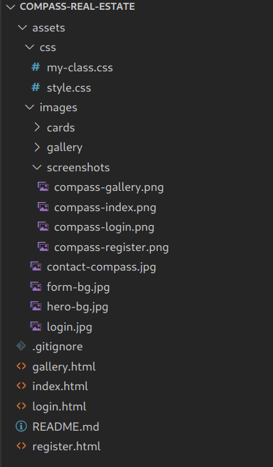

# Compass Real Estates

## About
Compass Real Estates is a company specialising in brockerage of most exclusive estates, providing everything from living spaces to high-tech business needs to clients all accross the globe.

* Exclusive brockerage in multiple countries and languages
* Access to off-market listings
* Custom tailored viewings and reports
* Most up-to date market information

We provide services for those who don't compromise.

## Idea

This was an excercise to create a site with as little information as possible. Random word generator was used to come up with the name of the project (company) and few keywords. Entire project was built out from that.

On the bottom of the index page, fake number generator is used to create valid contact numbers from different continents. 

## Styling
There are two CSS files, mostly because it looks cleaner that way, at least for me:

* style.css - takes care of the layout

* my-class.css - fine tuning classes

## Site functionality
### Index page 

#### - Sticky navigation 
* contains links to different parts of the site

#### - Hero section 
* main image with headline

#### - About section 
* short description of the company and what it does
* card elements with pictures and descriptions of industries
    
#### - Footer
* Social media links
* Main contact numbers
* Office locations

### Gallery
#### -Sticky navigation
* contains links to different parts of the site

#### -Gallery section
* Grid with images of living spaces

### Register
#### -Sticky navigation
* contains links to different parts of the site
#### - Register Form
* Register form with four inputs:
    * First name (Required) 
    * Last name (Required)
    * Email (Required)
    * Phone number

### Login
#### -Sticky navigation
* contains links to different parts of the site
* Login form with two inputs:
    * Username (Required) 
    * Password (Required)

### Tested on
#### Windows 10 
* Edge - version 100.0.1185.39
* Chrome - version 101.0.4951.41
* Firefox - version 99.0.1
#### Ubuntu 22.04
* Chrome - version 101.0.4951.41
* Firefox - 99.0.1
#### iPadOS
* Safari - version 15.3

Multiple resolutions tested

No bugs found after testing

### Attributions

Tools used for this project

Random word generator
> https://randomwordgenerator.com/

Phone number generator
> https://randommer.io/Phone

Images for the site
> https://unsplash.com/

 

## Deployment

To run this locally, first clone the repo with

> git clone https://github.com/Azelliott/compass-real-estate.git

You can then use any server to serve static files (Apache, Nginx, Node.js...),
or run the files directly from disk

## Demo
[Compass Real Estates](https://azelliott.github.io/compass-real-estate/)

## Project structure

## Site navigation
### Index page 

### Galley

### Register 

### Login form

