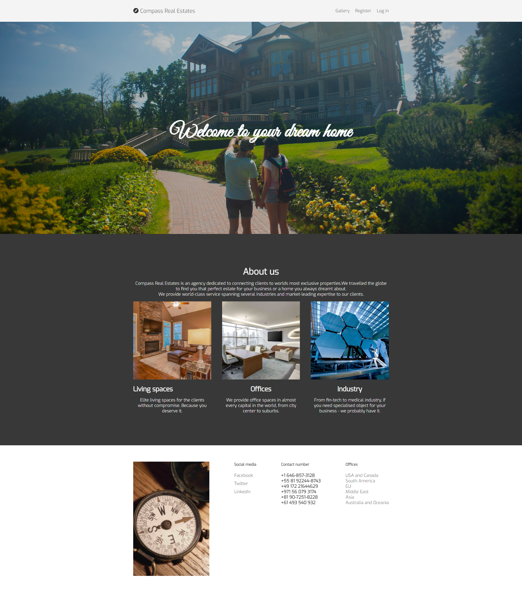
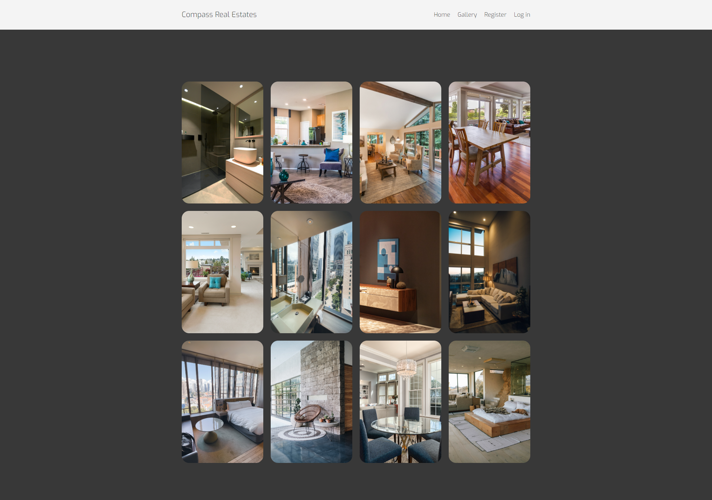
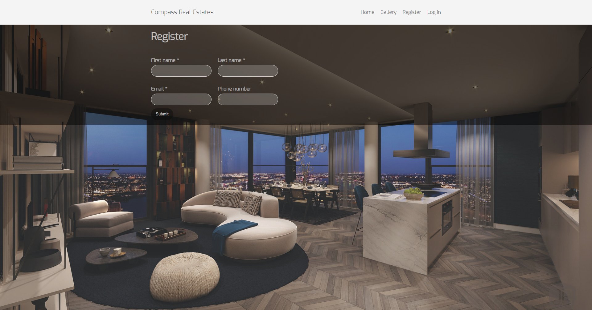

# Compass Real Estates
#### first project for Code Institute

### Project goal
Create responsive page using HTML and CSS

### About
Compass Real Estates is an imaginary company specializing in elite estates around the world.

As I didn't had an inspiration for the website, I used random word generator to come up with the name of the project, and keywords
Fake number generator is used to create contact numbers on the bottom of the index page 

### Styling
There are two CSS files, mostly because it looks cleaner that way, at least for me

style.css - takes care of the layout
my-class.css - fine tuning classes

### Demo
[Visit site](https://azelliott.github.io/compass-real-estate/)

### Site navigation
#### Index page consists of sticky navigation with links, about section containing card elements and contact footer

#### Galley has several images in a grid layout

#### Register 

#### Login form

